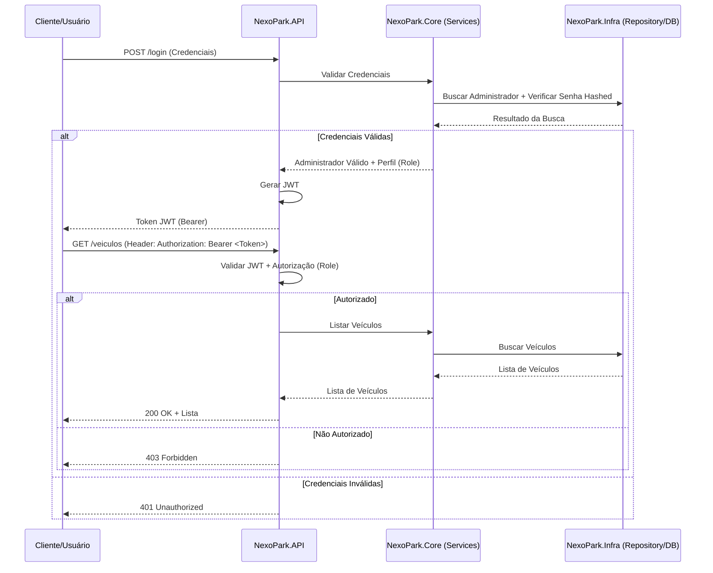

# NexoPark: API de Gestão de Veículos


---

### **Índice**

- [NexoPark: API de Gestão de Veículos](#nexopark-api-de-gestão-de-veículos)
    - [**Índice**](#índice)
    - [📝 **Descrição do Projeto**](#-descrição-do-projeto)
      - [⚙️ **Tecnologias Utilizadas**](#️-tecnologias-utilizadas)
      - [📁 **Estrutura do Projeto**](#-estrutura-do-projeto)
      - [📈 **Fluxo de Funcionamento**](#-fluxo-de-funcionamento)
      - [🚀 **Funcionalidades e Demonstração**](#-funcionalidades-e-demonstração)
      - [💻 **Como Usar a Aplicação**](#-como-usar-a-aplicação)
      - [👥 **Equipe do Projeto**](#-equipe-do-projeto)
      - [✅ **Conclusão**](#-conclusão)
      - [📸 **Prévia do Projeto**](#-prévia-do-projeto)

---

### 📝 **Descrição do Projeto**

O NexoPark é uma API RESTful desenvolvida com **Minimal APIs do .NET**, focada no registro e gestão de veículos. O objetivo principal é fornecer uma plataforma robusta e segura para o controle de um estacionamento, incluindo a autenticação de administradores com diferentes níveis de acesso via **JWT (JSON Web Tokens)**.

O projeto segue princípios de **Clean Architecture** e utiliza **Entity Framework Core** para persistência de dados. A segurança e a manutenibilidade são prioridades, com foco em testes abrangentes (unidade, integração e requisição) e documentação via **Swagger/OpenAPI**.

#### ⚙️ **Tecnologias Utilizadas**
- **Linguagem:** C#
- **Framework:** .NET 8 (Minimal APIs)
- **Persistência:** Entity Framework Core (EF Core)
- **Banco de Dados:** PostgreSQL (sugerido via Docker)
- **Autenticação:** JWT (JSON Web Tokens)
- **Documentação:** Swagger/OpenAPI
- **Testes:** xUnit
- **Containerização/DevOps:** Docker, GitHub Actions/GitLab CI

#### 📁 **Estrutura do Projeto**
A arquitetura é organizada em uma Solution (`.sln`) com projetos separados para promover a **Separação de Preocupações (Separation of Concerns)** e o **DIP (Dependency Inversion Principle)**.

```
nexopark/
├── src/
│   ├── NexoPark.API/    # Endpoints HTTP e configuração da aplicação (Camada de Apresentação)
│   ├── NexoPark.Core/   # Regras de Negócio, Entidades e Abstrações/Interfaces (Camada de Domínio)
│   └── NexoPark.Infra/  # Contexto de Dados (EF Core), Repositórios e Serviços de Infraestrutura (Camada de Persistência)
└── tests/
├── NexoPark.Tests.Unit/      # Testes de unidade para a lógica do Core
└── NexoPark.Tests.Integration/ # Testes de Persistência e End-to-End da API
```
#### 📈 **Fluxo de Funcionamento**
O fluxo de autenticação e acesso aos recursos é o seguinte:


#### 🚀 **Funcionalidades e Demonstração**
**Principais Funcionalidades**
- **Autenticação e Autorização por perfil (Admin/Editor) via JWT.**

- CRUD (Create, Read, Update, Delete) de Veículos.

- Validação robusta de entrada de dados.

- Documentação automática da API via Swagger/OpenAPI.

**Como funciona**
(Será detalhado após a implementação dos endpoints e Swagger)

#### 💻 **Como Usar a Aplicação**
(Será detalhado com instruções de Docker e dotnet run nas próximas etapas)

#### 👥 **Equipe do Projeto**
<a href="https://github.com/amaro-netto" title="Amaro Netto"></a>

#### ✅ **Conclusão**
(Será preenchido na conclusão do LAB)

#### 📸 **Prévia do Projeto**
(Será adicionado o link para o Swagger/Imagens aqui)