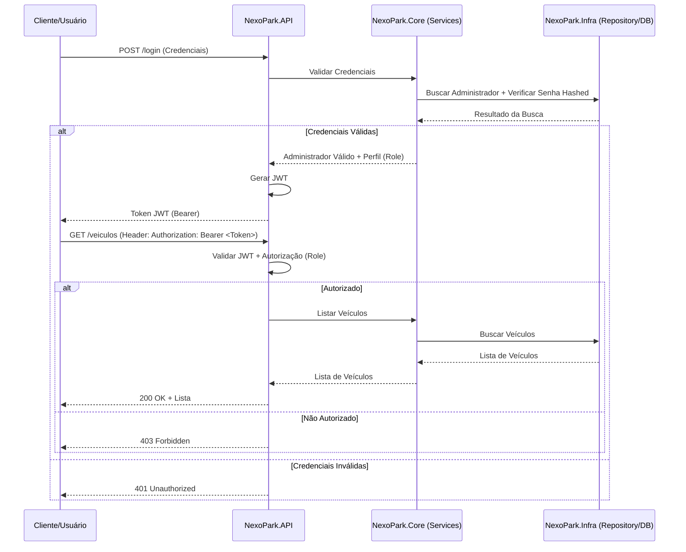

# NexoPark: API de Gestão de Veículos


## 📖 Descrição

O **NexoPark** é uma API RESTful desenvolvida para o desafio de projeto da trilha de .NET. O objetivo foi criar um sistema robusto de gestão de estacionamentos utilizando **Minimal APIs** do .NET 8, focando em performance e simplicidade.

O projeto vai além de um simples CRUD, implementando regras de negócio reais, autenticação segura via **JWT (JSON Web Tokens)** e seguindo os princípios da **Clean Architecture** para garantir escalabilidade e testabilidade.

## 🚀 Funcionalidades

Com base no desenvolvimento realizado, o sistema entrega:

- **Autenticação e Autorização:**
  - Login administrativo com validação segura.
  - Geração de Token JWT (Bearer).
  - Controle de acesso baseado em perfis: `Administrador` (Acesso total) e `Editor` (Acesso restrito).
- **Gestão de Veículos:**
  - Cadastro, Listagem, Atualização e Remoção de veículos.
  - Validação de placas e dados de entrada.
- **Documentação:**
  - Interface Swagger/OpenAPI interativa configurada para suportar autenticação JWT.
- **Qualidade de Código:**
  - Testes de Unidade (Unit Tests).
  - Testes de Integração e Persistência.
  - Testes de Requisição (Endpoints).

## 🛠️ Tecnologias Utilizadas

- **Linguagem:** C#
- **Framework:** .NET 8 (Minimal APIs)
- **Banco de Dados:** PostgreSQL (via Docker)
- **ORM:** Entity Framework Core (com Migrations e Seeds)
- **Autenticação:** JWT (JSON Web Tokens)
- **Testes:** xUnit
- **Documentação:** Swashbuckle (Swagger)

## 🏗️ Estrutura do Projeto (Clean Architecture)

A solução foi estruturada para promover a Separação de Preocupações (SoC) e Inversão de Dependência (DIP):

```text
nexopark/
├── src/
│   ├── NexoPark.API/    # Camada de Apresentação (Endpoints e Configurações)
│   ├── NexoPark.Core/   # Camada de Domínio (Entidades e Interfaces)
│   └── NexoPark.Infra/  # Camada de Infraestrutura (EF Core, Repositórios)
└── tests/
    ├── NexoPark.Tests.Unit/      # Testes de regras de negócio
    └── NexoPark.Tests.Integration/ # Testes de banco e fluxo completo
```
#### 📈 **Fluxo de Funcionamento**
O fluxo de autenticação e acesso aos recursos é o seguinte:


## 🔌 Endpoints Principais

| Método | Rota | Descrição | Acesso |
|---|---|---|---|
| `POST` | `/login` | Autentica o usuário e retorna o Token JWT | Público |
| `POST` | `/veiculos` | Cadastra um novo veículo | Adm/Editor |
| `GET` | `/veiculos` | Lista todos os veículos | Adm/Editor |
| `GET` | `/veiculos/{id}` | Busca um veículo por ID | Adm/Editor |
| `PUT` | `/veiculos/{id}` | Atualiza dados do veículo | Adm |
| `DELETE` | `/veiculos/{id}` | Remove um veículo do sistema | Adm |

## ⚙️ Como Executar

### Pré-requisitos
- .NET 8 SDK instalado.
- Docker (opcional, caso queira rodar o banco em container).
- Editor de código (VS Code ou Visual Studio).

### Passo a Passo

1. **Clone o repositório:**
   ```bash
   git clone [https://github.com/seu-usuario/nexopark.git](https://github.com/seu-usuario/nexopark.git)
   cd nexopark
   ```

2. **Configure o Banco de Dados:**
   No arquivo `appsettings.json`, verifique a string de conexão. Se estiver usando Docker:
   ```bash
   docker run --name nexopark-db -e POSTGRES_PASSWORD=suasenha -p 5432:5432 -d postgres
   ```

3. **Execute as Migrações:**
   Para criar as tabelas e o administrador padrão (Seed):
   ```bash
   dotnet ef database update --project src/NexoPark.Infra --startup-project src/NexoPark.API
   ```

4. **Inicie a Aplicação:**
   ```bash
   dotnet run --project src/NexoPark.API
   ```

5. **Acesse o Swagger:**
   Abra o navegador em `http://localhost:5000/swagger` (ou a porta indicada no terminal).

## 🧪 Executando os Testes

Para garantir a integridade da aplicação, execute o comando na raiz da solução:

```bash
dotnet test
```

---
Desenvolvido como parte do desafio técnico de .NET.

#### 👥 **Equipe do Projeto**
<a href="https://github.com/amaro-netto" title="Amaro Netto"></a>
